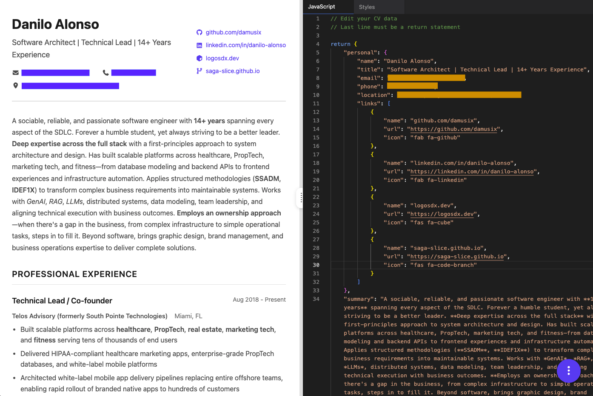

# CV Generator

Create and edit your CVs using JavaScript. Style it if you want. Print it, save it as PDF, and send it to your recruiter.

---

## How to Use

The application features a split-pane layout with your CV preview on the left and the editor on the right. You can resize the divider between the panes by dragging it. Choose between **JavaScript** or **Styles** mode using the tabs at the top of the editor. Make your changes and press `⌘S` / `Ctrl+S` to apply. Press `⌘P` / `Ctrl+P` to print or save as PDF.

**Fullscreen Mode**: Press `⌘\` / `Ctrl+\` to toggle fullscreen view. The shortcut is context-aware: when the editor is focused, it fullscreens the editor pane; otherwise, it fullscreens the CV preview pane.

On mobile devices, press `⌘E` / `Ctrl+E` to toggle the editor overlay.

### Editor Modes

#### JavaScript Mode

Use JavaScript to generate your CV data dynamically:

    // Calculate years of experience
    const startYear = 2016;
    const yearsExp = new Date().getFullYear() - startYear;

    return {
      personal: {
        name: "Your Name",
        title: "Your Title",
        email: "email@example.com",
        phone: "+1234567890",
        location: "City, Country"
      },
      summary: `Professional with ${yearsExp}+ years of experience`,
      sections: [
        // ... your sections
      ]
    };

**Important:** Your code must end with a `return` statement that returns the CV data object.

#### Styles Mode

Customize the appearance with CSS:

    /* Override design tokens */
    :root {
      --accent-color: #2563eb;
      --text-primary: #1a1a1a;
      --text-secondary: #4a4a4a;
    }

    /* Custom styles for specific sections */
    #experience .item {
      border-left: 2px solid var(--accent-color);
      padding-left: 1rem;
    }

### Data Structure

Your CV data follows this schema:

- **personal** (required)
    - `name` (string, required)
    - `title` (string, optional)
    - `email` (string, required, validated)
    - `phone` (string, required)
    - `location` (string, required)
    - `links` (array, optional) - Array of `{ name, url, icon? }`

- **summary** (string, optional) - Markdown-supported professional summary

- **sections** (array, required) - At least one section required
    - `id` (string, required) - Used for styling hooks
    - `heading` (string, required) - Section title
    - `items` (array, required) - At least one item required
        - `title` (string, required)
        - `subtitle` (string, optional)
        - `period` (object, optional) - `{ start?, end? }`
        - `location` (string, optional)
        - `content` (array, optional) - Markdown strings
        - `tags` (array, optional) - Skill/tech tags

---

## Extensibility

### Adding Custom Sections

Simply add to the `sections` array:

    {
      "id": "publications",
      "heading": "Publications",
      "items": [
        {
          "title": "Paper Title",
          "subtitle": "Journal Name",
          "period": { "start": "2023" },
          "content": ["Brief description"]
        }
      ]
    }

### Custom Section Styling

Target sections by their `id` in the Styles editor:

    #publications {
      border-left: 3px solid var(--accent-color);
      padding-left: 1rem;
    }

    #publications .item-header {
      font-style: italic;
    }

### Validation Rules

Extend validation in [validation.js](assets/js/validation.js) by modifying the Zod schemas.

---

## Features

### Split-Pane Layout & Fullscreen

Desktop view features a resizable split-pane layout. Drag the divider to adjust pane sizes (saved to localStorage). Toggle fullscreen mode with `⌘\` / `Ctrl+\` - context-aware to fullscreen either the editor or CV preview based on focus. Mobile displays as an overlay editor.

### Markdown Support

Use markdown syntax in `summary` and `content` fields: `**bold**`, `*italic*`, `` `code` ``, `[links](url)`

### Font Awesome Icons

Add icons to links using Font Awesome classes. Browse icons at [fontawesome.com](https://fontawesome.com/icons)

    {
      "name": "GitHub",
      "url": "https://github.com/username",
      "icon": "fab fa-github"
    }

### Auto-save & Export

Changes auto-save to localStorage (including drafts and cursor position per mode). Export to `.cvml` files with tagged sections: `[cv-data js]` for data, `[cv-styles]` for CSS.

### Print Optimization

Print-optimized layout with proper page breaks, 0.75in margins, and clean styling.

---

## Keyboard Shortcuts

| Shortcut | Action |
|----------|--------|
| `⌘E` / `Ctrl+E` | Toggle editor (mobile only) |
| `⌘P` / `Ctrl+P` | Print CV |
| `⌘S` / `Ctrl+S` | Apply changes (when editor is focused) |
| `⌘\` / `Ctrl+\` | Toggle fullscreen (context-aware: editor pane when editor is focused, CV pane otherwise) |
| `?` | Show help (when not typing in editor) |
| `ESC` | Close menu |
| `ESC ESC` (within 1s) | Close editor (mobile only) |

---

## Technical Overview

### Architecture

Single-page application with modular JavaScript architecture:

    index.html
    ├── assets/
    │   ├── css/
    │   │   ├── base.css          # CSS reset, tokens, typography
    │   │   ├── cv.css            # CV layout and styling
    │   │   ├── editor.css        # VSCode-style editor panel
    │   │   ├── split-pane.css    # Split-pane layout system
    │   │   ├── action-menu.css   # Floating action menu
    │   │   ├── modal.css         # Modal dialog styling
    │   │   ├── toast.css         # Toast notification styling
    │   │   └── print.css         # Print-specific styles
    │   └── js/
    │       ├── main.js           # Entry point, initialization
    │       ├── config.js         # Default CV data, constants
    │       ├── validation.js     # Zod schema validation
    │       ├── storage.js        # localStorage persistence
    │       ├── cv-renderer.js    # CV rendering functions
    │       ├── editor.js         # Monaco editor setup
    │       ├── split-pane.js     # Split-pane layout management
    │       ├── observable.js     # Event system using LogosDX Observer
    │       ├── styles.js         # Custom styles management
    │       ├── exports.js        # Import/export functionality
    │       ├── action-menu.js    # Action menu behavior
    │       ├── modal.js          # Help modal management
    │       ├── toast.js          # Toast notification system
    │       ├── keyboard.js       # Keyboard shortcuts
    │       ├── markdown.js       # Markdown rendering
    │       └── ui-utils.js       # UI utility functions (fullscreen, etc.)

### Core Technologies

- **Monaco Editor** (v0.52.2) - Code editor with syntax highlighting
- **markdown-it** (v14.1.0) - Markdown parsing
- **Zod** (v3.23.8) - Runtime schema validation
- **Font Awesome** (v6.7.1) - Icon library

### Storage System

localStorage keys:

- `cv-data-code` - Raw editor content (JavaScript)
- `cv-data-result` - Evaluated JSON result from code
- `cv-editor-mode` - Current editor mode ('javascript' | 'css')
- `cv-custom-styles` - Custom CSS styles
- `cv-editor-state` - Editor UI state (fullscreen, etc.)
- `cv-editor-cursor-{mode}` - Cursor position per mode
- `cv-editor-draft-{mode}` - Draft content per mode
- `cv-split-pane-sizes` - Saved pane widths for desktop layout

### Validation

Zod schemas enforce:

- Valid email format
- Valid URLs for links
- Required fields (name, email, phone, location)
- At least one section with one item
- Proper data types throughout

### Rendering Pipeline

**Initialization:**

1. Load and apply custom styles from localStorage
2. Initialize Monaco Editor (lazy-loaded from CDN)
3. Load saved data/drafts from localStorage
4. Restore cursor position per mode

**On Apply Changes:**

1. Parse code based on mode (Function evaluation for JavaScript, direct CSS for Styles)
2. Validate with Zod schema (for JavaScript mode)
3. Render markdown with markdown-it (for CV content)
4. Build DOM structure
5. Save code and result to localStorage
6. Clear draft (since changes are applied)

**Auto-save:**

- Draft content saved on every edit (debounced)
- Cursor position tracked on every change
- Editor state (fullscreen, etc.) persisted

### Browser Compatibility

**Required:**

- ES6+ support (modules, arrow functions, template literals)
- localStorage API
- CSS Grid & Flexbox
- Modern event APIs

**Recommended:**

- Chrome/Edge 90+
- Firefox 88+
- Safari 14+

### Performance

- Monaco Editor lazy-loaded from CDN (~2MB)
- Other dependencies (markdown-it, Font Awesome, Zod) loaded from CDN
- localStorage limited to ~5-10MB (CV data typically <100KB)
- Async initialization for styles and editor setup
- Debounced draft auto-save (500ms delay)

---

## License

MIT License - Feel free to use and modify for your needs.

---

CV Generator by [@damusix](https://github.com/damusix)
